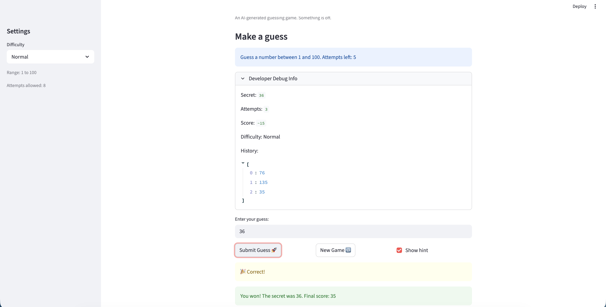

# 🎮 Game Glitch Investigator: The Impossible Guesser

## 🚨 The Situation

You asked an AI to build a simple "Number Guessing Game" using Streamlit.
It wrote the code, ran away, and now the game is unplayable. 

- You can't win.
- The hints lie to you.
- The secret number seems to have commitment issues.

## 🛠️ Setup

1. Install dependencies: `pip install -r requirements.txt`
2. Run the app: `python -m streamlit run app.py`
3. Run tests: `pytest tests/ -v`

## 🕵️‍♂️ Your Mission

1. **Play the game.** Open the "Developer Debug Info" tab in the app to see the secret number. Try to win.
2. **Find the State Bug.** Why does the secret number change every time you click "Submit"?
3. **Fix the Logic.** The hints ("Higher/Lower") are wrong. Fix them.
4. **Refactor & Test.** Move the logic into `logic_utils.py`, then run `pytest` until all tests pass.

## 📝 Document Your Experience

- [x] **Game purpose:** A number-guessing game where the player tries to guess a randomly chosen secret number within a limited number of attempts, with difficulty settings that control the range and attempt count.
- [x] **Bugs found:**
  1. Hints were backwards ("Go HIGHER" when guess was too high)
  2. Secret number converted to string on even attempts, breaking comparisons
  3. Attempts counter started at 1 instead of 0 (lost one attempt)
  4. Hard mode range was 1–50 instead of 1–500
  5. Score added +5 for "Too High" on even attempts instead of subtracting
  6. "New Game" button didn't reset game status, history, or score
  7. Range display was hardcoded to "1 and 100" regardless of difficulty
  8. All game logic lived in `app.py` instead of `logic_utils.py`
- [x] **Fixes applied:**
  1. Refactored `check_guess` to return only the outcome string; built a separate `get_message()` helper with correct hint directions
  2. Removed the `str()` conversion on even attempts — just use `st.session_state.secret` directly
  3. Changed initial `attempts` from `1` to `0`
  4. Updated Hard range from `(1, 50)` to `(1, 500)` in `get_range_for_difficulty`
  5. Unified `update_score` to always subtract 5 on a wrong guess
  6. Added `status`, `history`, and `score` resets to the New Game handler
  7. Replaced hardcoded range string with `f"{low}"` and `f"{high}"`
  8. Moved all four logic functions into `logic_utils.py`

## 📸 Demo

- 

## 🚀 Stretch Features

- [x] **Challenge 1: Advanced Edge-Case Testing** — 21 pytest cases covering negative numbers, decimals, very large values, boundary guesses, score floor, and difficulty-range fallback. See `tests/test_game_logic.py`.